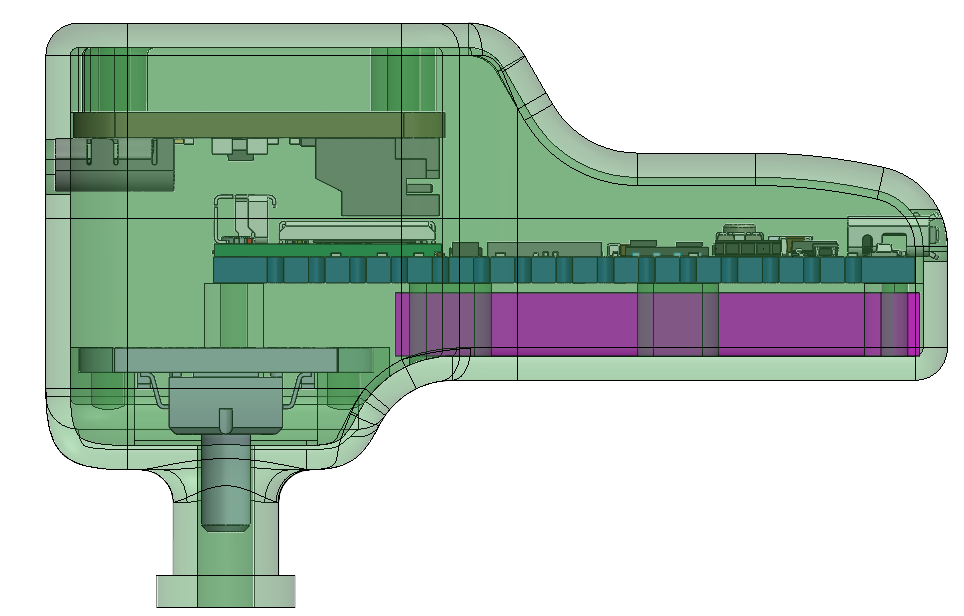
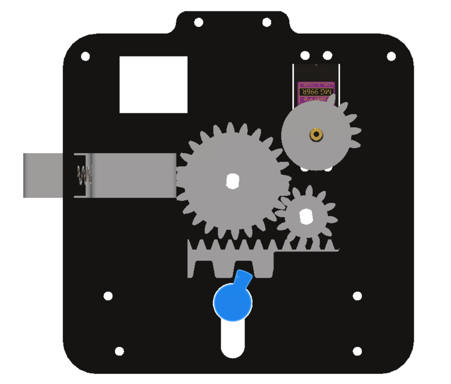
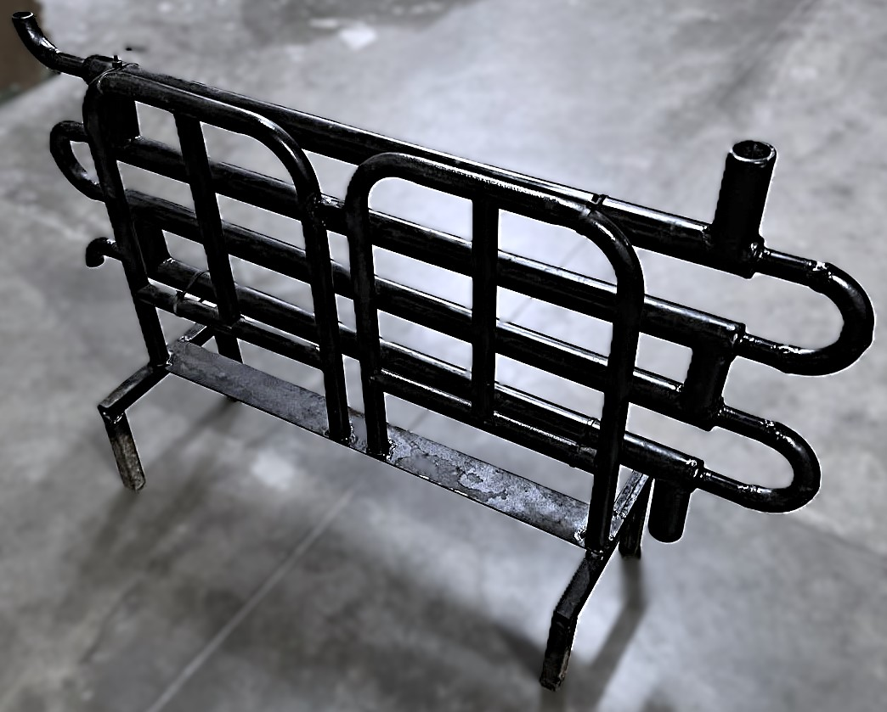

## Ear pressure Monitoring device
Design and fabrication of a device to predict potential health issues by monitoring pressure variations in the tympanic membrane. A functional prototype is being developed, with plans in place for a medical trial to validate its effectiveness. Upon successful testing, the device could potentially be mass-produced to make this health-monitoring innovation widely accessible.

## Coupling of Biometric and manual lock
The project aimed to develop a prototype for a digital locking system that integrates a manual cylinder lock mechanism with fingerprint recognition, enabling the door to be unlocked either via an authorized fingerprint or a key, with each method functioning independently. I designed an innovative mechanism incorporating sector gears, a cam, a spring, and a rack-and-pinion assembly to achieve seamless operation of the lock. The prototype was fabricated using 3D printing, and subsequent testing verified its functionality, demonstrating precise and reliable performance in both unlocking modes.

## Double Pipe Heat Exchanger
A double-pipe heat exchanger was designed, manufactured, and tested to meet specific performance requirements. Necessary design parameters were calculated for the intended application, and the exchanger was assembled using machine shop facilities. Final testing confirmed that the exchanger met all specified heat and pressure criteria, ensuring reliable operation under the designated conditions.

